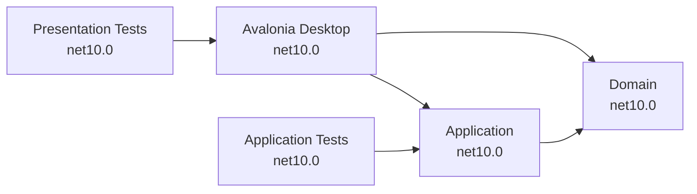

# .NET 10 and Avalonia Migration Implementation Plan

## Objective

Replace the .NET MAUI presentation layer with an Avalonia 12 desktop application, upgrade the solution to .NET 10, and produce self-contained Windows and Linux packages suitable for distribution through modding websites.

The migration must preserve all current behavior while removing the requirement for MAUI workloads and mobile or macOS platform targets.

## Target Platforms

| Platform | Runtime identifier | Initial package formats |
| --- | --- | --- |
| Windows 10/11 x64 | `win-x64` | Portable ZIP and installer |
| Desktop Linux x64 | `linux-x64` | TAR.GZ and DEB |

ARM64 packages are outside the initial scope and can be added when demand is established.

## Target Architecture



### Projects retained

- `BethesdaVoiceLineCharacterCounter.Domain`
- `BethesdaVoiceLineCharacterCounter.Application`
- `BethesdaVoiceLineCharacterCounter.Application.Tests`
- `BethesdaVoiceLineCharacterCounter.Test`, converted to framework-neutral view-model tests

### Project replaced in place

- `BethesdaVoiceLineCharacterCounter` changes from a multi-target MAUI project to a `net10.0` Avalonia desktop executable.

Retaining the project and assembly name minimizes solution churn and preserves the expected executable name for existing users.

## Guiding Decisions

- Use the latest stable Avalonia 12 release and keep all Avalonia package versions aligned.
- Use `CommunityToolkit.Mvvm` for observable properties and commands.
- Use compiled Avalonia bindings throughout the application.
- Start with ordinary self-contained folder publishing.
- Do not enable trimming, single-file publishing, ReadyToRun, or Native AOT until baseline packages have passed clean-machine testing.
- Do not mechanically translate the generated MAUI resource dictionaries. Create only the Avalonia styles needed by the application.
- Keep Avalonia dependencies out of the Application and Domain projects.
- Do not introduce dependency injection unless a concrete external dependency requires it.

## Phase 1: Establish the .NET 10 Baseline

### Tasks

- [ ] Add a repository-level `global.json` targeting the selected .NET 10 SDK feature band.
- [ ] Change the Domain project target framework from `net8.0` to `net10.0`.
- [ ] Change the Application project target framework from `net8.0` to `net10.0`.
- [ ] Change the Application test project target framework from `net8.0` to `net10.0`.
- [ ] Upgrade `Microsoft.NET.Test.Sdk`, xUnit, the Visual Studio test adapter, and Coverlet to current compatible stable versions.
- [ ] Fix nullable warnings in models, DTOs, utilities, and tests that are encountered by the upgrade.
- [ ] Run the Application test project independently of the MAUI project.

### Validation

```powershell
dotnet restore .\BethesdaVoiceLineCharacterCounter.Application.Tests\BethesdaVoiceLineCharacterCounter.Application.Tests.csproj
dotnet test .\BethesdaVoiceLineCharacterCounter.Application.Tests\BethesdaVoiceLineCharacterCounter.Application.Tests.csproj -c Debug --no-restore
```

### Exit criteria

- Application and Domain compile on .NET 10 without MAUI workloads.
- All Application tests pass.
- No new compiler warnings are introduced.

## Phase 2: Scaffold the Avalonia Desktop Project

### Tasks

- [ ] Install or update the Avalonia templates.
- [ ] Generate a temporary Avalonia MVVM application to capture current Avalonia 12 project and startup conventions.
- [ ] Convert `BethesdaVoiceLineCharacterCounter.csproj` to a single-target `net10.0` desktop executable.
- [ ] Add aligned package references for Avalonia, Avalonia Desktop, Fluent theme, and Debug-only diagnostics.
- [ ] Add `CommunityToolkit.Mvvm`.
- [ ] Retain references to the Application and Domain projects.
- [ ] Add Avalonia `Program.cs`, `App.axaml`, and `App.axaml.cs` startup files.
- [ ] Add application icons as Avalonia resources.
- [ ] Confirm that an empty main window starts on Windows before migrating feature UI.

### Reference commands

```powershell
dotnet new install Avalonia.Templates
dotnet new avalonia.mvvm -o .\artifacts\AvaloniaTemplateReference
dotnet restore .\BethesdaVoiceLineCharacterCounter\BethesdaVoiceLineCharacterCounter.csproj
dotnet run --project .\BethesdaVoiceLineCharacterCounter\BethesdaVoiceLineCharacterCounter.csproj
```

The temporary template reference must not be committed as a product project.

### Exit criteria

- The presentation project builds without any MAUI package or workload.
- An Avalonia window launches on Windows.
- The Application and Domain references resolve under `net10.0`.

## Phase 3: Convert the View Model

### Tasks

- [ ] Remove the `Microsoft.Maui.Controls` dependency from `VoiceLineCounterViewModel`.
- [ ] Derive the view model from `ObservableObject`.
- [ ] Replace manual property notification with CommunityToolkit MVVM observable properties.
- [ ] Replace the MAUI `Command` with a generated relay command.
- [ ] Treat the selected game as nullable until the user selects one.
- [ ] Requery command availability when input text or selected game changes.
- [ ] Preserve the existing calls to `GetBethesdaGames` and `GetLineStatistics`.
- [ ] Ensure the initial statistics state matches current behavior.

### Exit criteria

- The view model has no Avalonia or MAUI imports.
- Existing command eligibility and statistics behavior are preserved.
- The view model can be instantiated and tested without starting a UI runtime.

## Phase 4: Rebuild the User Interface

### Planned view structure

```text
BethesdaVoiceLineCharacterCounter/
|-- App.axaml
|-- App.axaml.cs
|-- Program.cs
|-- Assets/
|-- ViewModels/
|   `-- VoiceLineCounterViewModel.cs
`-- Views/
    |-- MainWindow.axaml
    |-- MainWindow.axaml.cs
    |-- VoiceLineCounterView.axaml
    |-- AboutView.axaml
    `-- HelpView.axaml
```

### Tasks

- [ ] Create `MainWindow` with a desktop-appropriate initial size and minimum dimensions.
- [ ] Replace MAUI Shell navigation with an Avalonia `TabControl` containing Calculator, About, and Help tabs.
- [ ] Convert the calculator page to an Avalonia `UserControl`.
- [ ] Use a `ComboBox` for game selection.
- [ ] Use a multiline, wrapping `TextBox` for voice-line input.
- [ ] Bind total characters and dialogue sections as read-only output.
- [ ] Bind the Run button to the converted command.
- [ ] Convert About and Help content to Avalonia `UserControl` views.
- [ ] Add compiled binding data types to every bound view.
- [ ] Add keyboard navigation, access keys where appropriate, accessible names, and logical tab order.
- [ ] Add only the styles required by the actual controls.
- [ ] Verify layout at 100%, 150%, and 200% display scaling.

### Control mapping

| MAUI control | Avalonia control |
| --- | --- |
| `Shell` | `Window` and `TabControl` |
| `ContentPage` | `UserControl` |
| `VerticalStackLayout` | `Grid` or `StackPanel` |
| `HorizontalStackLayout` | Horizontal `StackPanel` |
| `Picker` | `ComboBox` |
| `Entry` | `TextBox` |
| `Label` | `TextBlock` |
| `Button` | `Button` |

### Exit criteria

- Calculator, About, and Help views are present and navigable.
- All bindings compile.
- No MAUI XAML remains in the active project.
- The complete workflow works with mouse and keyboard.

## Phase 5: Remove MAUI Artifacts

### Tasks

- [ ] Remove `MauiProgram.cs`.
- [ ] Remove the MAUI `App.xaml` and code-behind after Avalonia startup is active.
- [ ] Remove `AppShell.xaml` and code-behind.
- [ ] Remove the unused template `MainPage.xaml` and code-behind.
- [ ] Remove `Platforms/Android`.
- [ ] Remove `Platforms/iOS`.
- [ ] Remove `Platforms/MacCatalyst`.
- [ ] Remove `Platforms/Tizen`.
- [ ] Remove `Platforms/Windows` because Avalonia owns desktop startup.
- [ ] Remove MAUI-only resources and generated template images.
- [ ] Remove MAUI package references and properties such as `UseMaui`, `SingleProject`, and platform target frameworks.
- [ ] Remove the generated `.csproj.user` file from source control if tracked.
- [ ] Verify that `dotnet workload maui` is not required to restore, build, test, or publish.

### Exit criteria

- Repository search finds no active `Microsoft.Maui`, MAUI XML namespace, or platform workload references.
- A clean restore succeeds with only the .NET 10 SDK and NuGet dependencies.

## Phase 6: Convert and Expand Tests

### Tasks

- [ ] Change `BethesdaVoiceLineCharacterCounter.Test` to plain `net10.0`.
- [ ] Remove `<UseMaui>true</UseMaui>`.
- [ ] Update view-model tests for CommunityToolkit command behavior.
- [ ] Preserve tests for game loading, command eligibility, character totals, and dialogue-section totals.
- [ ] Add a test proving input text alone cannot run without a selected game.
- [ ] Add or confirm tests at exact game character limits and immediately above those limits.
- [ ] Add one Avalonia Headless smoke test only if loading and binding the main window provides useful regression coverage.
- [ ] Remove the empty disposable presentation-test fixture if it no longer serves a purpose.

### Validation

```powershell
dotnet test .\BethesdaVoiceLineCharacterCounter.slnx -c Debug
```

### Exit criteria

- All existing 32 tests pass or are replaced by equivalent tests.
- New boundary and eligibility tests pass.
- Tests do not require a MAUI workload or interactive desktop session.

## Phase 7: Configure Self-Contained Publishing

### Tasks

- [ ] Add a `win-x64` publish profile.
- [ ] Add a `linux-x64` publish profile.
- [ ] Set product name, assembly version, file version, and informational version consistently.
- [ ] Embed the Windows executable icon.
- [ ] Publish self-contained folder deployments for both runtime identifiers.
- [ ] Confirm no .NET runtime installation is required on test machines.
- [ ] Keep trimming, single-file, ReadyToRun, and Native AOT disabled for the baseline release.

### Reference commands

```powershell
dotnet publish .\BethesdaVoiceLineCharacterCounter\BethesdaVoiceLineCharacterCounter.csproj `
  -c Release -r win-x64 --self-contained true `
  -o .\artifacts\publish\win-x64

dotnet publish .\BethesdaVoiceLineCharacterCounter\BethesdaVoiceLineCharacterCounter.csproj `
  -c Release -r linux-x64 --self-contained true `
  -o .\artifacts\publish\linux-x64
```

### Exit criteria

- Both publish commands complete without warnings requiring action.
- Published applications start on clean Windows and Linux machines without .NET installed.
- Application assets and icons load from the published output.

## Phase 8: Create Distribution Packages

### Windows artifacts

- [ ] Create a versioned portable ZIP from the `win-x64` publish output.
- [ ] Create an Inno Setup or WiX installer.
- [ ] Add Start menu integration and uninstall registration.
- [ ] Preserve the established executable name.
- [ ] Sign the executable and installer when a code-signing certificate is available.
- [ ] Test installation, upgrade, uninstall, and portable execution on a clean Windows VM.

### Linux artifacts

- [ ] Create a versioned TAR.GZ from the `linux-x64` publish output with executable permissions preserved.
- [ ] Create a DEB package with files under `/usr/lib/bethesda-voice-line-character-counter`.
- [ ] Add a launcher under `/usr/bin`.
- [ ] Add a freedesktop `.desktop` entry and hicolor application icons.
- [ ] Declare required .NET runtime dependencies for the selected .NET 10 Linux baseline and Avalonia dependencies such as `libx11-6`, `libice6`, `libsm6`, and `libfontconfig1`.
- [ ] Evaluate Avalonia Parcel for reproducible DEB, RPM, and ZIP generation.
- [ ] Test on Ubuntu/Debian and at least one non-Debian distribution.

### Expected artifact names

```text
BethesdaVoiceLineCharacterCounter-<version>-win-x64-portable.zip
BethesdaVoiceLineCharacterCounter-<version>-win-x64-setup.exe
BethesdaVoiceLineCharacterCounter-<version>-linux-x64.tar.gz
BethesdaVoiceLineCharacterCounter-<version>-linux-x64.deb
```

### Exit criteria

- Every package launches without a separately installed .NET runtime.
- Package installation and removal leave no unexpected files behind.
- SHA-256 checksums are generated for public artifacts.

## Phase 9: Add Continuous Integration

### Tasks

- [ ] Add a Windows job that restores, builds, tests, publishes `win-x64`, and packages artifacts.
- [ ] Add a Linux job that restores, builds, tests, publishes `linux-x64`, and packages artifacts.
- [ ] Run Linux UI smoke tests with Avalonia Headless or a virtual display when needed.
- [ ] Cache NuGet packages without caching publish outputs.
- [ ] Upload versioned artifacts and SHA-256 checksum files.
- [ ] Trigger release packaging from version tags.
- [ ] Keep signing credentials in the CI secret store and never in repository files.

### Exit criteria

- A clean tagged build produces reproducible Windows and Linux artifacts.
- Pull requests run build and test checks without producing releases.
- Release jobs fail when tests, packaging, or checksum generation fails.

## Phase 10: Post-Migration Optimization

These items are explicitly deferred until baseline self-contained packages are stable.

- [ ] Measure startup time, memory use, and archive size.
- [ ] Evaluate single-file publishing separately for each runtime identifier.
- [ ] Evaluate compression only after measuring startup impact.
- [ ] Enable trimming only after resolving every trim-analysis warning and completing full workflow tests.
- [ ] Evaluate Native AOT only if the measured startup or package-size benefit justifies the added build and compatibility constraints.
- [ ] Add ARM64 runtime identifiers when user demand warrants them.

## Final Acceptance Checklist

- [ ] Every product and test project targets `net10.0`.
- [ ] The solution restores and builds without MAUI workloads.
- [ ] No Android, iOS, Mac Catalyst, Tizen, WinUI, or MAUI targets remain.
- [ ] Application and Domain contain no presentation-framework dependencies.
- [ ] All existing functionality is available in the Avalonia application.
- [ ] All existing tests pass, including equivalent replacements where APIs changed.
- [ ] Avalonia compiled bindings produce no errors.
- [ ] The application is usable with mouse and keyboard.
- [ ] The UI is verified on Windows and Linux at common display scale factors.
- [ ] Windows and Linux self-contained applications run without .NET installed.
- [ ] Portable and installed package workflows pass clean-machine tests.
- [ ] Public artifacts have versioned names and SHA-256 checksums.
- [ ] The README documents supported operating systems, installation, portable use, and Linux package dependencies.

## Suggested Implementation Order

1. Upgrade and validate Domain, Application, and Application tests on .NET 10.
2. Convert the presentation project to a minimal launching Avalonia application.
3. Convert and validate the view model.
4. Implement the calculator view and validate its workflow.
5. Implement About and Help views.
6. Remove MAUI and platform-specific artifacts.
7. Convert presentation tests and run the full solution suite.
8. Add and validate self-contained publish profiles.
9. Add Windows and Linux packaging.
10. Add CI and clean-machine release validation.

Each step should end with its focused validation before moving to the next step. This keeps framework-upgrade failures, UI-conversion failures, and packaging failures independently diagnosable.
